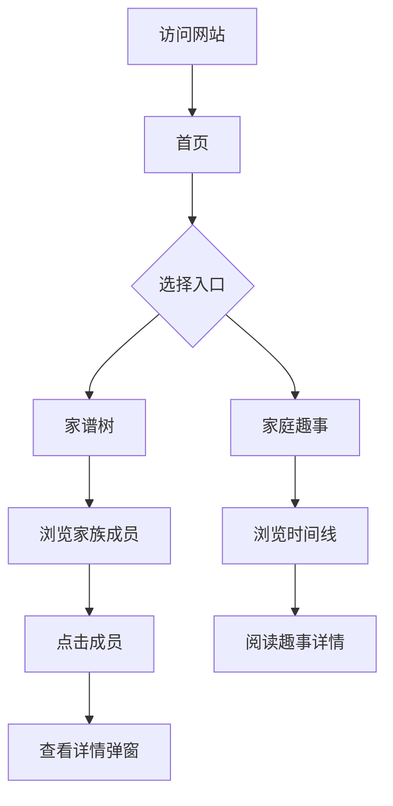

# 产品需求文档 (PRD)

## 1. 产品概述

一个温馨的家庭展示网站，用于展示家庭成员（家谱树形式）和家庭趣事（时间线形式）。风格参考苹果官网的清新简约设计，并加入魔幻星星特效，为家人提供一个温馨、有趣的线上空间。

- **目标用户**：家庭成员，同时作为网页开发学习案例
- **核心价值**：记录家庭回忆，增进家庭成员间的情感联系

---

## 2. 核心功能

### 2.1 功能模块

1. **首页**：网站入口，展示温馨的家庭氛围，引导用户浏览家谱树和家庭趣事
2. **家谱树页面**：以树状结构展示家庭成员，按辈分分支组织
3. **家庭趣事页面**：以时间线形式展示家庭趣事，图文混合

### 2.2 页面详情

| 页面名称 | 模块名称 | 功能描述 |
|---------|---------|---------|
| 首页 | Hero区域 | 温馨的家庭主题背景，欢迎语，导航按钮 |
| 首页 | 快捷入口 | 家谱树入口、家庭趣事入口卡片 |
| 家谱树 | 家族树展示 | 树状结构展示三代家庭成员，支持点击查看详情 |
| 家谱树 | 成员详情弹窗 | 展示成员照片、姓名、简介、工作、爱好 |
| 家庭趣事 | 时间线展示 | 按时间倒序展示家庭趣事，图文混合 |
| 家庭趣事 | 趣事卡片 | 每条趣事包含标题、日期、图片、描述 |

---

## 3. 核心流程

用户访问网站后，首先看到温馨的首页，可以选择进入家谱树或家庭趣事页面。在家谱树页面，用户可以浏览家族成员，点击成员查看详细信息。在家庭趣事页面，用户可以按时间线浏览家庭故事。

---

## 4. 用户界面设计

### 4.1 设计风格

- **主色调**：暖色系（柔和的橙色、米色、淡粉色）搭配清新的白色背景
- **辅助色**：金色点缀（星星特效）、淡紫色（梦幻感）
- **按钮风格**：圆角、柔和阴影、悬停时有微动效
- **字体**：
  - 标题：思源宋体 / Noto Serif SC（优雅、温馨）
  - 正文：思源黑体 / Noto Sans SC（清晰、易读）
- **布局风格**：卡片式布局，大量留白，苹果风格简洁
- **特效**：鼠标移动时产生五颜六色的星星往下坠落

### 4.2 页面设计概览

| 页面名称 | 模块名称 | UI元素 |
|---------|---------|--------|
| 首页 | Hero区域 | 大标题"我的家"，温馨背景图，渐变遮罩，导航按钮 |
| 首页 | 快捷入口 | 两个卡片，圆角，柔和阴影，图标+文字 |
| 家谱树 | 家族树展示 | 树状结构，成员头像卡片，SVG连线，辈分标签 |
| 家谱树 | 成员详情弹窗 | 居中弹窗，头像、信息列表，关闭按钮 |
| 家庭趣事 | 时间线展示 | 左侧时间轴，右侧趣事卡片，交替排列 |
| 家庭趣事 | 趣事卡片 | 图片、标题、日期、描述，悬停放大效果 |

### 4.3 响应式设计

- **桌面优先**：主要针对电脑端设计，大屏幕展示完整家谱树
- **平板适配**：调整布局，家谱树可滚动查看
- **手机适配**：单列布局，时间线简化，星星特效保留

---

## 5. 特效设计

### 5.1 鼠标星星特效

- **触发**：鼠标在页面移动时
- **效果**：产生五颜六色的小星星，从鼠标位置往下坠落
- **动画**：星星有旋转、缩放、透明度渐变效果
- **性能**：使用CSS动画，限制同时存在的星星数量

### 5.2 页面过渡动画

- **页面加载**：元素依次淡入
- **卡片悬停**：轻微上浮，阴影加深
- **弹窗出现**：淡入+缩放动画

---

## 6. 示例数据

### 6.1 家庭成员

| 姓名 | 辈分 | 角色 | 工作 | 爱好 |
|-----|-----|-----|-----|-----|
| 爷爷 | 第一代 | 家长 | 退休教师 | 下棋、养花 |
| 爸爸 | 第二代 | 父亲 | 工程师 | 运动、阅读 |
| 妈妈 | 第二代 | 母亲 | 医生 | 烹饪、旅行 |
| 伯伯 | 第二代 | 伯父 | 商人 | 钓鱼 |
| 叔叔 | 第二代 | 叔父 | 教师 | 书法 |
| 姑姑 | 第二代 | 姑母 | 设计师 | 绘画 |
| 我 | 第三代 | 子女 | 初中生 | 编程、游戏 |
| 妹妹 | 第三代 | 子女 | 小学生 | 画画、跳舞 |

### 6.2 家庭趣事

| 标题 | 日期 | 描述 |
|-----|-----|-----|
| 2024年春节团圆 | 2024-02-10 | 全家人齐聚一堂，爷爷亲自下厨做了一桌丰盛的年夜饭... |
| 暑假海边之旅 | 2023-07-15 | 一家人去了海边度假，妹妹第一次看到大海... |
| 爷爷的生日惊喜 | 2023-03-20 | 全家人为爷爷准备了生日惊喜，爷爷感动得热泪盈眶... |

---

*文档创建时间：2026-06-13*