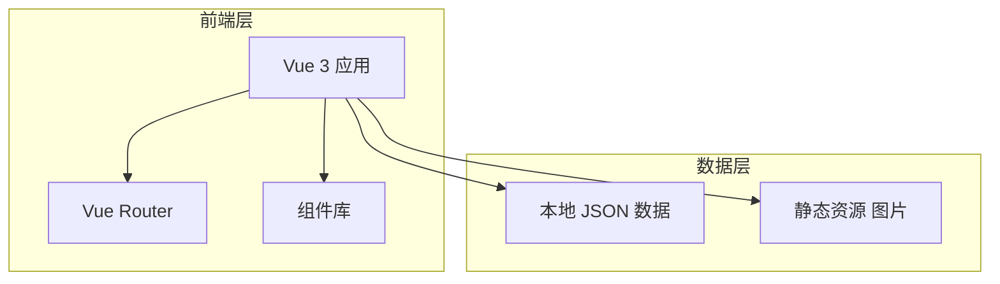
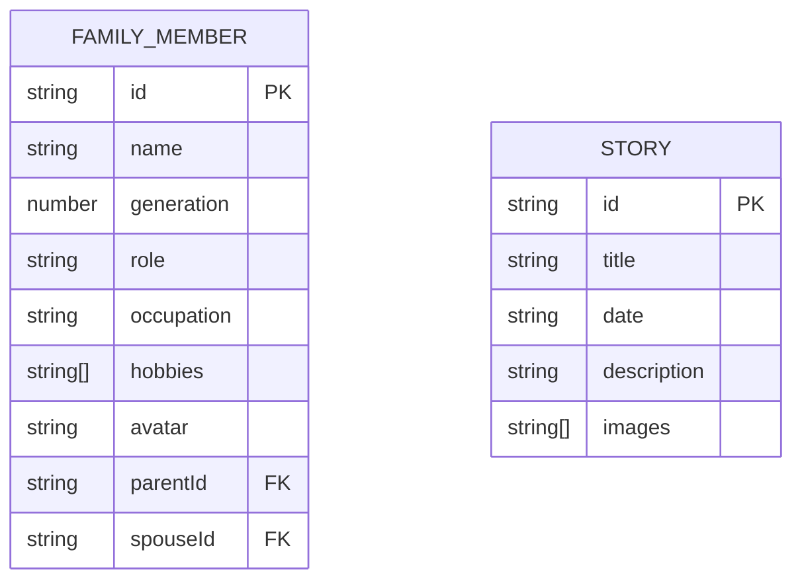
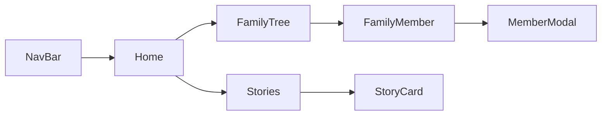

# 技术架构文档

## 1. 架构设计

本项目采用纯前端架构，无需后端服务。数据使用本地JSON文件存储，适合作为学习案例和静态部署。



---

## 2. 技术说明

| 层级 | 技术选型 | 版本 | 说明 |
|-----|---------|-----|-----|
| 前端框架 | Vue | 3.x | 响应式框架，组件化开发 |
| 构建工具 | Vite | 5.x | 快速开发服务器，热更新 |
| 样式方案 | Tailwind CSS | 3.x | 原子化CSS，快速构建响应式布局 |
| 路由 | Vue Router | 4.x | 单页应用路由管理 |
| 图标 | Lucide Icons | - | 现代图标库 |

### 2.1 技术选型理由

- **Vue 3**：轻量、易上手，Composition API 便于管理家庭成员和趣事数据
- **Vite**：开发体验极佳，启动快，热更新即时生效
- **Tailwind CSS**：快速构建苹果风格简洁设计，响应式布局简单
- **纯前端架构**：适合静态部署（如 GitHub Pages），无需服务器

---

## 3. 路由定义

| 路由路径 | 页面名称 | 说明 |
|---------|---------|-----|
| `/` | 首页 | 网站入口，展示欢迎信息和快捷入口 |
| `/family-tree` | 家谱树 | 展示家族成员树状结构 |
| `/stories` | 家庭趣事 | 时间线形式展示家庭趣事 |

---

## 4. 目录结构

```
my_home/
├── index.html
├── package.json
├── vite.config.js
├── tailwind.config.js
├── postcss.config.js
├── src/
│   ├── main.js              # 应用入口
│   ├── App.vue              # 根组件
│   ├── router/
│   │   └── index.js         # 路由配置
│   ├── views/
│   │   ├── Home.vue         # 首页
│   │   ├── FamilyTree.vue   # 家谱树页面
│   │   └── Stories.vue      # 家庭趣事页面
│   ├── components/
│   │   ├── StarEffect.vue   # 星星特效组件
│   │   ├── FamilyMember.vue # 家庭成员卡片组件
│   │   ├── MemberModal.vue  # 成员详情弹窗组件
│   │   ├── StoryCard.vue    # 趣事卡片组件
│   │   └── NavBar.vue       # 导航栏组件
│   ├── data/
│   │   ├── family.json      # 家庭成员数据
│   │   └── stories.json     # 家庭趣事数据
│   └── assets/
│       └── images/          # 图片资源
└── public/
    └── favicon.ico
```

---

## 5. 数据模型

### 5.1 家庭成员数据模型

```json
{
  "id": "string",
  "name": "string",
  "generation": "number",
  "role": "string",
  "occupation": "string",
  "hobbies": ["string"],
  "avatar": "string",
  "parentId": "string | null",
  "spouseId": "string | null"
}
```

### 5.2 家庭趣事数据模型

```json
{
  "id": "string",
  "title": "string",
  "date": "string",
  "description": "string",
  "images": ["string"]
}
```

### 5.3 数据关系图



---

## 6. 组件设计

### 6.1 核心组件

| 组件名称 | 功能描述 | Props |
|---------|---------|-------|
| StarEffect | 全局星星特效，跟随鼠标移动 | 无 |
| NavBar | 顶部导航栏，响应式菜单 | 无 |
| FamilyMember | 家庭成员卡片，显示头像和基本信息 | member: Object |
| MemberModal | 成员详情弹窗 | member: Object, visible: Boolean |
| StoryCard | 趣事卡片，显示标题、日期、图片、描述 | story: Object |

### 6.2 组件交互流程



---

## 7. 特效实现方案

### 7.1 星星特效

使用原生 JavaScript + CSS 动画实现：

1. 监听 `mousemove` 事件
2. 动态创建星星 DOM 元素
3. 随机颜色、大小、旋转角度
4. CSS `@keyframes` 实现下落动画
5. 动画结束后移除 DOM 元素

```javascript
// 伪代码示例
document.addEventListener('mousemove', (e) => {
  const star = createStar(e.clientX, e.clientY);
  document.body.appendChild(star);
  setTimeout(() => star.remove(), 2000);
});
```

### 7.2 性能优化

- 限制同时存在的星星数量（最多 50 个）
- 使用 `requestAnimationFrame` 优化动画
- 使用 CSS `will-change` 提示浏览器优化

---

## 8. 响应式断点

| 断点名称 | 宽度范围 | 布局调整 |
|---------|---------|---------|
| 桌面端 | ≥ 1024px | 完整家谱树，双列趣事卡片 |
| 平板端 | 768px - 1023px | 家谱树可滚动，单列趣事卡片 |
| 手机端 | < 768px | 单列布局，简化家谱树，汉堡菜单 |

---

## 9. 部署方案

- **开发环境**：`npm run dev` 启动 Vite 开发服务器
- **生产构建**：`npm run build` 生成静态文件
- **部署平台**：GitHub Pages / Vercel / Netlify（任选其一）

---

*文档创建时间：2026-06-13*